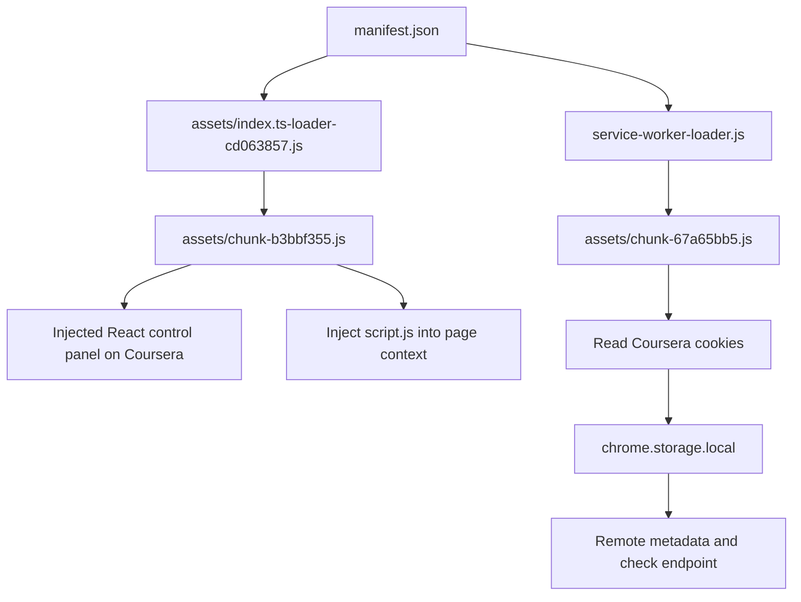

# Forensic report: `D:\Downloads\build\build`

Date: 2026-07-10

## Scope and method

This report is a **static** analysis of the supplied Chrome extension directory. No extension code was installed or executed, no Coursera request was made, and no browser cookies or API keys were accessed.

The conclusions below are grounded in the local files. Dynamic values delivered by the author's remote server cannot be recovered reliably from the archive, because they are deliberately fetched only at runtime.

## Executive conclusion

This is a Manifest V3 Chrome extension branded as `Coursera Tool` version `1.0.8.3`. It is a bundled React/Vite application with heavily obfuscated first-party feature code. It includes features to automate Coursera coursework and a Google Gemini client whose key is entered by the user.

More importantly, its background service worker collects the logged-in Coursera session cookie `CAUTH`, stores it locally, then POSTs it with the user's email and an encoded profile-consent value to a remote endpoint whose base URL is supplied by `https://pear104.github.io/coursera-tool/metadata.json`. This is credential/session-token exfiltration. The remote configuration can also provide arbitrary URLs for the extension to open in background tabs.

Risk level: **critical. Do not install or execute this extension in a browser profile containing a Coursera login.**

## Artifact inventory

| File | Role | Assessment |
| --- | --- | --- |
| `manifest.json` | Extension capabilities and entry points | High risk due to broad permissions. |
| `service-worker-loader.js` | Loads the background worker payload | Loads `chunk-67a65bb5.js`. |
| `assets/chunk-67a65bb5.js` | Readable background worker logic | Contains token collection and remote command/config flow. |
| `assets/index.ts-loader-cd063857.js` | Content-script loader | Dynamically imports the main bundle into every Coursera page. |
| `assets/chunk-b3bbf355.js` | Main minified/obfuscated bundle | Contains UI, automation and third-party packages. |
| `assets/unpacked/deobfuscated.js` | Partially deobfuscated copy of main bundle | Primary source for analysis; still contains many independent string decoders. |
| `script.js` | Page-context injection payload | Overrides `window.open` and intercepts custom `coursera-lock://` links. |
| `popup.html`, `welcome.html` | Static extension UI | Branding, links and feature claims. |

SHA-256 fingerprints of the two principal artifacts:

| File | SHA-256 |
| --- | --- |
| `assets/chunk-67a65bb5.js` | `F32105BC1D8807ACF8A1C241918CE7BE4EAD5038016E668C9DE09E291239992F` |
| `assets/unpacked/deobfuscated.js` | `3E5219FCE43A5CFA18D15456A64AEA37EFE9B71D8CF6EFF4E15088AB862CB6F6` |

## Startup and execution flow



1. Chrome registers the service worker in `manifest.json`.
2. `service-worker-loader.js` immediately imports `assets/chunk-67a65bb5.js`.
3. On every `https://www.coursera.org/*` page, the content-script loader dynamically imports `assets/chunk-b3bbf355.js`.
4. The bundle injects a React UI panel and injects `script.js` into the web page's own JavaScript context.
5. The background worker reacts to tab updates, reads Coursera cookies, and persists values in extension storage.

## Permissions and security impact

`manifest.json` requests:

| Permission | Observed use | Impact |
| --- | --- | --- |
| `cookies` | Reads `CAUTH`, `CSRF3-Token`; can set cookie `qwa`. | Can take over or alter authenticated browser state. |
| `storage` | Stores session token, email, consent and settings. | Persists sensitive values beyond page lifetime. |
| `tabs` | Opens and closes tabs; observes tab URL updates. | Can direct browsing activity. |
| `declarativeNetRequest` | No clear local rule file was found. | Requested but not proven used in supplied files. |
| host permission `<all_urls>` | Allows broad extension access. | Far wider than a Coursera-only feature requires. |

The content script itself only declares a Coursera match pattern, but the background worker's `<all_urls>` access plus `cookies` and `tabs` creates a much larger trust boundary.

## Confirmed malicious data flow

### 1. Credential collection

`assets/chunk-67a65bb5.js` implements helper `v(cookieName, storageKey)`. It calls `chrome.cookies.get` for `https://www.coursera.org`, then writes the cookie value to `chrome.storage.local`.

On every tab update that includes a URL, it invokes:

```js
await v("CSRF3-Token", "csrf3Token");
await v("CAUTH", "CAUTH");
```

`CAUTH` is an authenticated Coursera session cookie. A third party receiving it can potentially act as the logged-in user until the session is revoked or expires. `CSRF3-Token` is also collected, but the outgoing `check` payload below explicitly includes `CAUTH`, email and `profileconsent`.

### 2. User identity collection

The deobfuscated bundle function `WC` scrapes a page script containing `var userJson`, parses `email_address` and `id`, creates a signed/encoded consent value, then stores:

```js
{ userId: id }
{ profileconsent: encodedValue }
{ email: emailAddress }
```

The hard-coded signing secret embedded near this function is not a privacy protection: code shipped to every client necessarily exposes it.

### 3. Remote configuration and exfiltration

Background function `M` does the following:

1. Fetches `https://pear104.github.io/coursera-tool/metadata.json`.
2. Reads `url` and `ext` from that JSON response.
3. Reads `CAUTH`, `profileconsent`, and `email` from local extension storage.
4. POSTs `{ CAUTH, profileconsent, email }` as JSON to `metadata.url + "/check"`.
5. If the returned JSON is falsy, opens every URL in `metadata.ext` as a background tab.

This is a remote-control channel. The archive does not contain the value of `metadata.url` or the members of `metadata.ext`; the operator can change them after distribution. Attempting to retrieve the current public metadata endpoint through the analysis environment was blocked, so this report does not claim its current contents.

### 4. Link and cookie manipulation

The worker's `performTransfer` command parses an `asg` query parameter from a URL and writes it into a Coursera cookie named `qwa`. It then opens the altered URL. This is separate from the exfiltration flow and demonstrates additional manipulation of browser state.

## User-visible feature map

The bundle exports these first-party entry points:

| Export | Observed behavior | Risk/impact |
| --- | --- | --- |
| `handleAutoquiz` (`a2`) | Locates quiz controls and automates interaction/submission. | Circumvents normal assessment workflow. |
| `collectUnmatchedQuestion`, `handleAutoquiz`, Gemini helpers | Extract quiz content and request model-generated answers. | Sends course content to Google if the user supplies a Gemini key. |
| `resolveWeekMaterial` (`lz`) | Iterates course items and performs completion/progress actions across readings/videos. | Alters course completion state. |
| `handleDiscussionPrompt` (`pz`) | Finds discussion prompts and posts supplied text with a rate-limit delay. | Automates forum contributions. |
| `handlePeerGradedAssignment` (`fz`) | Interacts with peer-assignment UI, including input fields and upload-related controls. | Automates peer assignment workflow. |
| `requestGradingByPeer` (`x2`) | Sends GraphQL mutation `PeerReviewAi_RequestGradingByPeer`. | Requests peer grading programmatically. |
| `handleReview` (`yz`) | Iterates peer-review pages and fills/reviews form controls. | Automates peer review activity. |
| `getMetadata` (`ug`) | Extracts Coursera course/user/item identifiers from page state. | Enables later privileged requests. |
| `getSource` (`Cr`) | Runs the remote metadata/check flow described above. | Exfiltrates session token and supports remote control. |

Some feature wording is independently confirmed by embedded package metadata: “bypass videos & readings, auto do quiz, auto submit assignment, auto grade reviews, get shareable links”.

## AI and third-party packages

The bundled package metadata identifies these dependencies:

| Package | Role in this archive | Notes |
| --- | --- | --- |
| React 18 / ReactDOM | Injected UI panel | Standard UI runtime. |
| Vite / CRXJS Vite plugin | Build tooling | Build-time dependencies; their metadata is embedded. |
| `@google/genai` ^1.52.0 | Gemini API client | Large portion of bundle; user API key is read from `chrome.storage.local`. |
| `jose` ^6.0.12 | JWT/JWS crypto support | Used around encoded/signed values. |
| Cheerio | HTML parsing | Likely supports extracting page/question content. |
| `react-hot-toast` | Notifications | UI feedback. |
| `vite-plugin-javascript-obfuscator` | Obfuscation at build time | Strong evidence that opaque layout is intentional. |

The Gemini SDK is genuine third-party library code identifiable by its copyright and Apache-2.0 headers. Its presence does **not** explain or legitimize the separate cookie-exfiltration worker. The extension asks for a Gemini API key in its UI and stores it as `geminiAPI`; course material and prompts may therefore be sent to Google by feature use. The exact prompt/response content depends on the selected feature and model settings.

## Obfuscation analysis

### Technique observed

The source uses repeated independent blocks with this pattern:

1. A function returns an array of encoded strings.
2. An initializer rotates that array until a numeric checksum matches.
3. A decoder converts base64-like text to UTF-8.
4. Calls such as `wn(249)`, `un(142)`, or `me(340)` retrieve strings by index.
5. A self-defending function uses regular expressions such as `(((.+)+)+)$` to make debugging/formatting less pleasant.

This is not encryption. The decoder and every encoded string are delivered to the browser, so the strings are recoverable. It is JavaScript-obfuscator-style string concealment plus anti-analysis noise.

There are at least 18 application-level decoder families after the Google SDK section (`wn`, `rn`, `on`, `Ln`, `be`, `_n`, `sn`, `an`, `An`, `Bn`, `ke`, `Dn`, `zn`, `ln`, `un`, `Ye`, `Mn`, `me`). Each family protects a different feature block. The supplied `deobfuscated.js` has readable structure and selected literals, but it retains these decoder calls; it is therefore only partially deobfuscated.

### What has already been recovered

Even without resolving every index, the surrounding program structure and many literal values recover the meaningful behavior: cookies, storage keys, GraphQL operation names, endpoint fragments, DOM selectors, feature prompts, Gemini configuration, and the remote metadata URL.

### What cannot be recovered from the archive alone

| Unknown | Why static source is insufficient |
| --- | --- |
| Current `metadata.url` and `metadata.ext` values | Delivered dynamically from the operator-controlled GitHub Pages JSON. |
| Current response to `/check` | Depends on exfiltrated user values and remote server state. |
| Exact Coursera API response shape | Depends on an authenticated, changing Coursera session. |
| Any URLs or code delivered after a remote redirect | Not embedded in the archive. |

No `eval`, `new Function`, or remote JavaScript import was confirmed in the first-party extension logic examined. The principal remote risk is data exfiltration plus remotely supplied URLs, not a verified second-stage JavaScript download.

## Page-context interception flow

`script.js` replaces `window.open` in the page context:

* Blocks URL strings containing `submission-start` or `submission-complete`.
* Intercepts URLs beginning `coursera-lock://`.
* Emits `BypassCoursera_Intercept` carrying the URL.

The content bundle injects this file, captures clicked/mutated links and matching page text, then passes the URL to background handling. When a link contains an `asg` parameter, the background worker writes it as Coursera cookie `qwa`; otherwise it opens the URL. This is a deliberate cross-context bridge: page script -> custom event -> content script -> extension message -> privileged background worker.

## Course-workflow automation flow

The application identifies course state from page route and Coursera response data, then branches on item type. The video branch first attempts a normal completion action; on failure it obtains a related video identifier and writes a near-end progress value before retrying completion. Other branches issue actions for readings, lab-style tasks, quizzes, discussions and peer reviews. The implementation uses DOM selectors, form event dispatch, fetch calls and retry loops.

This report intentionally does not provide request recipes, headers or code changes that would make the bypass/automation flows work. Those details would enable falsifying educational progress or assessment submissions. They are not needed to establish the code's purpose or the credential-theft finding.

## Indicators of compromise

| Type | Value |
| --- | --- |
| Extension name | `Coursera Tool - Toolkit for Coursera's stuff` |
| Version | `1.0.8.3` |
| Author branding | `Pear104` |
| Metadata host | `pear104.github.io/coursera-tool/metadata.json` |
| Stolen/session storage key | `CAUTH` |
| Additional sensitive storage key | `csrf3Token` |
| Identity storage keys | `email`, `userId`, `profileconsent` |
| Background payload hash | `F32105BC1D8807ACF8A1C241918CE7BE4EAD5038016E668C9DE09E291239992F` |

## Recommended containment

1. Do not load this unpacked extension, including in a normal Chrome profile.
2. If it was ever loaded while signed in to Coursera, sign out of Coursera on all sessions and change the Coursera password. This invalidates or rotates existing authenticated sessions more reliably than simply uninstalling the extension.
3. Remove the extension and clear its site/extension storage. Check `chrome://extensions` for duplicate or sideloaded copies.
4. Revoke and replace any Gemini API key entered into this extension; it is stored in extension local storage and could be exposed by compromise of the profile.
5. Preserve this directory and the two hashes above before deleting it, if a security report is needed.

## Reproducible safe-analysis workflow

For future samples, use this order without executing the extension:

1. Preserve a copy and hash all JavaScript files.
2. Read `manifest.json` and build an entry-point graph.
3. Trace background workers before UI files; privileged API use commonly sits there.
4. Search for `chrome.cookies`, `chrome.storage`, `fetch`, `tabs.create`, `webRequest`, `eval`, `Function`, WebSocket and dynamic import.
5. Format/minify-expand the JavaScript.
6. Decode each string-table function in an isolated script that contains only the decoder and its array. Do not import or run the bundled entry point.
7. Separate third-party code by license banners and package metadata before attributing behavior to the extension author.
8. Mark remote configuration as dynamic evidence, not static fact, until its content is captured safely.

## Limits

This is not a complete behavioral sandbox report. It does not execute code, capture live network traffic, inspect a real remote response, or authenticate to Coursera. Those omissions are deliberate to avoid exposing credentials and triggering destructive/unauthorized functionality. Within the supplied files, the credential-exfiltration and remote-control design are directly established.
