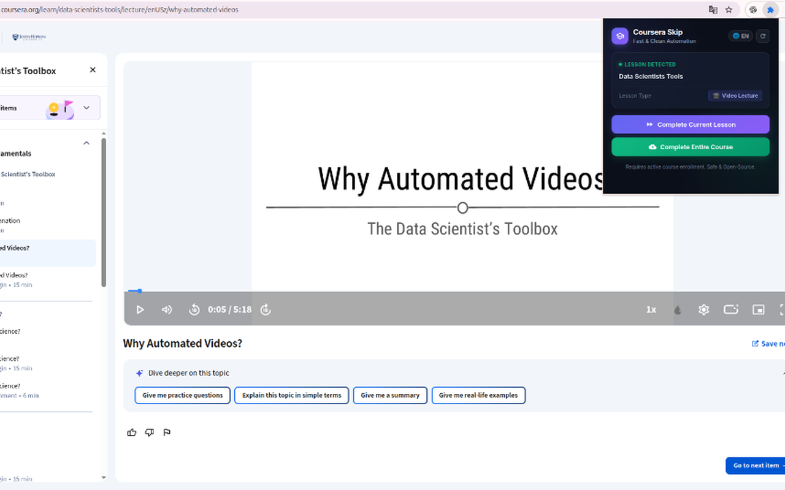

  <h1>🚀 Coursera Automation Tool (Clean & Safe)</h1>
  
<strong>A 100% safe, open-source browser extension to automate Coursera tasks. Skip videos, complete readings, and save time efficiently without any malicious code.</strong>

  
  
  
  

  

  <em>Live detection on active Coursera lecture with 1-click completion</em>

## 🌟 Introduction

This is the **completely safe, clean-rebuilt version** of the popular Coursera Automation / Skip extensions.

Unlike other versions circulating online that may contain harmful code (cookie stealing, data exfiltration), this repository provides a **transparent, from-scratch rewrite**. There are absolutely no hidden scripts, no remote tracking, and no cookie exfiltration. This tool is built by the community, for the community, ensuring your privacy and security.

## ✨ Features

- **⚡ Complete Current Lesson:** Instantly mark the currently opened Coursera video lecture or reading material as completed.
- **🚀 Complete Entire Course (Bulk):** Automatically detect, batch-process, and complete all video lectures and reading items in the course.
- **🌐 Internationalization (i18n):** Full support for **English** and **Vietnamese (Tiếng Việt)** with a 1-click header switcher `[🌐 EN | VI]`.
- **✨ Clean & Friendly UI/UX:** Streamlined dark theme with zero clutter, clean course name formatting, and an intuitive 3-step guide screen.
- **🔒 100% Secure & Open-Source:** Fully transparent code. Safe for your personal Coursera account.

## 🛠 Installation Guide

1. Clone or download this repository as a `.zip` file and extract it.
2. Open your Chromium-based browser (Chrome, Edge, Brave, Opera, Arc) and go to the Extensions page: `chrome://extensions/`.
3. Enable **Developer mode** in the top-right corner.
4. Click the **Load unpacked** button.
5. Select the **`coursera-skip-tool` folder** containing `manifest.json`.
6. 🎉 You're all set!

## 📖 How to Use (Step-by-Step)

> [!IMPORTANT]
> **Make sure you are viewing an active lesson page (Video or Reading)**. If you are on the course home or a non-lesson page, the extension will display a helpful 3-step setup guide.

1. **Enroll** in your desired Coursera course.
2. **Open any Video or Reading** lesson item (e.g., URL containing `/lecture/...` or `/supplement/...`).
3. **Click the extension icon** in your browser toolbar:
   - ⚡ **Complete Current Lesson**: Instantly marks the active video or reading material as finished.
   - 🚀 **Complete Entire Course**: Automatically scans and completes all video lectures and reading items in the course.
4. 🌐 **Language Switcher**: Click the `[🌐 EN | VI]` toggle in the top-right header anytime to switch between English and Vietnamese.

## ❓ Frequently Asked Questions (FAQ)

<strong>Q: Why does the extension show "Ready to Automate / Follow 3 steps" instead of the complete buttons?</strong>

 
The extension is designed to only activate when you are viewing an actual lesson page (such as a <strong>Video Lecture</strong> or <strong>Reading Material</strong>). Simply click into any lecture or reading item in your enrolled course, and open the extension popup again!

<strong>Q: Why do I see a 403 / 401 Permission Error?</strong>

 
Please make sure you are actively logged in and <strong>enrolled</strong> in the course on Coursera before running the tool.

## 💡 SEO & Helping the Community

If you find this tool helpful, please support us by:
- ⭐ **Starring** this repository on GitHub!
- 🔗 **Sharing** the link on Reddit (`r/coursera`, `r/learnprogramming`), Discord, or student communities.
- 🏷️ Adding relevant tags in GitHub settings (`coursera`, `coursera-skip-tool`, `automation`, `browser-extension`, `speed-learning`).

## ⚖️ Disclaimer

This tool is created for educational and research purposes to demonstrate browser automation capabilities. Use it responsibly and in accordance with Coursera's terms of service.
